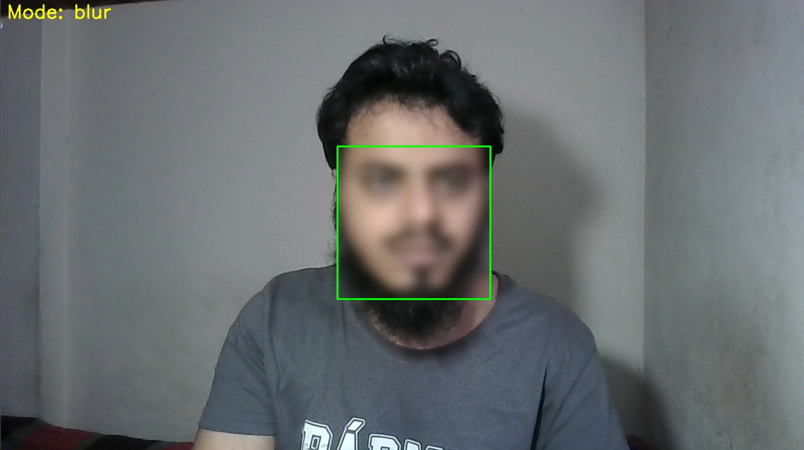
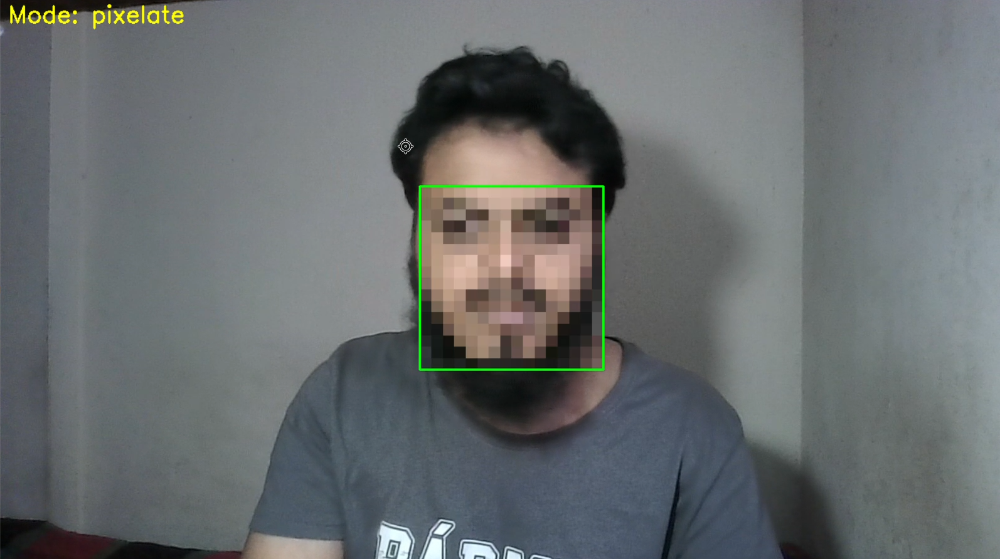
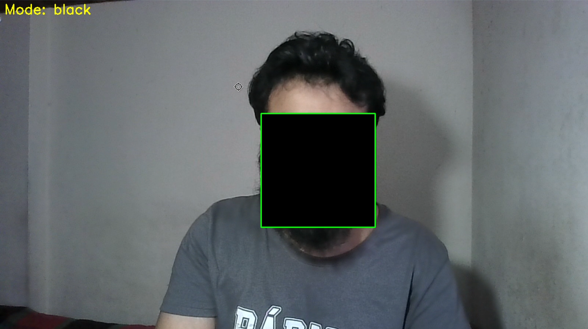

# Face Anonymizer using OpenCV & MediaPipe

## 📌 Overview

This project is a real-time face anonymization system using OpenCV and MediaPipe. It detects faces from a webcam feed and applies different privacy-preserving effects such as blur, pixelation, or masking.

---

## 🎥 Demo





---

## 🎯 Objectives

* Detect human faces in real-time
* Apply anonymization techniques to protect identity
* Practice computer vision and real-time processing

---

## 🛠️ Technologies Used

* Python
* OpenCV
* MediaPipe (Tasks API)
* NumPy

---

## ⚙️ Features

* Real-time face detection using MediaPipe
* Multiple anonymization modes:

  * Blur
  * Pixelation
  * Black masking
* Webcam-based live processing
* Keyboard-controlled mode switching

---

## ⌨️ Controls

| Key | Action        |
| --- | ------------- |
| `b` | Blur mode     |
| `p` | Pixelate mode |
| `m` | Black mask    |
| `q` | Quit program  |

---

## 📂 Project Structure

```
face-anonymizer-opencv/
│── main.py
│── model/
│   └── blaze_face_short_range.tflite
│── data/
│   └── Human_image_test.jpg
│── README.md
```

---

## 🚀 How It Works

1. Capture frames from webcam
2. Convert frame from BGR to RGB
3. Detect faces using MediaPipe Face Detector
4. Extract bounding box of each detected face
5. Apply selected anonymization method:

   * Blur: Gaussian smoothing
   * Pixelate: Downscale and upscale image
   * Mask: Replace face with black region
6. Display processed frame in real-time

---

## ▶️ How to Run

### 1. Install dependencies

```bash
pip install opencv-python mediapipe numpy
```

### 2. Run the application

```bash
python main.py
```

---

## 📊 Applications

* Privacy protection in surveillance systems
* Dataset preprocessing
* Research in computer vision
* Ethical AI development

---

## 📈 Future Improvements

* Add face tracking to improve stability
* Improve detection using advanced models (YOLO)
* Add GUI for mode selection
* Enable video recording of anonymized output

---

## 👤 Author

Sultan Ahmmed

---

## 📜 License

This project is for educational purposes.
